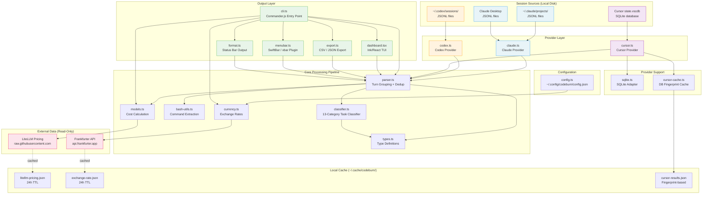

# CodeBurn -- Full Project Audit

**Date:** 2026-04-15
**Scope:** Architecture, implementation, security, testing, strengths, weaknesses
**Codebase version:** 0.5.0 (3,591 lines across 19 TypeScript files)

---

## 1. What CodeBurn Does

CodeBurn is a CLI tool that shows developers where their AI coding tokens go. It reads local session files from Claude Code, Cursor, and Codex (OpenAI), calculates costs using real model pricing, and presents the data as an interactive terminal dashboard, a macOS menu bar widget, or CSV/JSON exports.

It answers questions like: "How much did I spend this week?", "Which task category burns the most tokens?", "Am I getting one-shot edits or burning retries?", and "Which model costs me the most?"

Key capabilities:

- Multi-provider support: Claude Code (JSONL), Cursor (SQLite), Codex (JSONL)
- 13-category task classifier (coding, debugging, refactoring, testing, etc.) using rule-based pattern matching -- no LLM calls
- Interactive TUI dashboard with gradient bar charts, keyboard navigation, period switching
- Cost calculation with live model pricing from LiteLLM and currency conversion (162 currencies)
- One-shot success rate tracking (detects edit-bash-edit retry cycles)
- CSV/JSON export with formula injection protection
- macOS menu bar plugin via SwiftBar/xbar

---

## 2. How It Works -- Architecture

### 2.1 Architecture Diagram



### 2.2 Data Flow (Simplified)

```txt
Session files on disk (JSONL / SQLite)
        |
   [ Providers ]  -- discover files, parse into unified format
        |
   [ Parser ]     -- group API calls into turns, deduplicate
        |
   [ Classifier ] -- assign task categories by tool/keyword patterns
        |
   [ Aggregator ] -- build per-session and per-project summaries
        |
   [ Models ]     -- calculate USD cost from token counts + pricing
        |
   [ Currency ]   -- convert USD to user's chosen currency
        |
   [ Output ]     -- TUI dashboard / status bar / CSV / JSON / menubar
```

### 2.3 Module Map (19 files, 3,591 lines)

| Module | Lines | Responsibility |
| -------- | ------- | ---------------- |
| cli.ts | 275 | Commander.js entry point, 8 commands |
| parser.ts | 508 | JSONL reading, turn grouping, session aggregation |
| dashboard.tsx | 667 | Ink/React TUI with responsive layout |
| providers/codex.ts | 305 | Codex JSONL parsing with differential token calculation |
| providers/cursor.ts | 283 | Cursor SQLite parsing, language extraction |
| menubar.ts | 263 | SwiftBar/xbar plugin generation |
| export.ts | 216 | CSV/JSON export with injection protection |
| models.ts | 190 | LiteLLM pricing fetch, cost calculation |
| classifier.ts | 163 | 13-category rule-based task classification |
| types.ts | 150 | Core type definitions |
| currency.ts | 140 | Exchange rates, formatting |
| providers/claude.ts | 105 | Claude session discovery |
| cursor-cache.ts | 63 | Cursor DB fingerprint cache |
| sqlite.ts | 58 | Lazy-load better-sqlite3 adapter |
| providers/index.ts | 49 | Provider registry |
| bash-utils.ts | 42 | Shell command extraction |
| format.ts | 41 | Token/cost formatting helpers |
| providers/types.ts | 37 | Provider interface |
| config.ts | 36 | Config file management |

### 2.4 Dependencies

Production (4): chalk, commander, ink, react
Optional (1): better-sqlite3 (Cursor only)
Dev (6): @types/better-sqlite3, @types/react, tsup, tsx, typescript, vitest

No networking libraries. The two outbound HTTP requests use Node 20's built-in `fetch`.

### 2.5 CLI Commands

| Command | Description |
| --------- | ------------- |
| `report` (default) | Interactive TUI dashboard |
| `today` | Today's dashboard |
| `month` | This month's dashboard |
| `status` | Compact output (terminal, menubar, or JSON) |
| `export` | CSV or JSON export |
| `currency [code]` | Set display currency |
| `install-menubar` | Install macOS menu bar plugin |
| `uninstall-menubar` | Remove menu bar plugin |

---

## 3. Implementation Deep Dive

### 3.1 Provider System

Each provider implements a common interface: `discoverSessions()`, `createSessionParser()`, `toolDisplayName()`, `modelDisplayName()`. This lets the parser module orchestrate all providers uniformly.

**Claude provider** discovers sessions by scanning `~/.claude/projects/` directories (and Claude Desktop paths). It reads JSONL files where each line is a user or assistant message. The actual parsing happens in `parser.ts`, which extracts token counts from the `usage` object, tool names from `tool_use` content blocks, and user messages from `user` entries.

**Codex provider** walks `~/.codex/sessions/YYYY/MM/DD/rollout-*.jsonl` with strict directory validation. It validates each file's first line is a `session_meta` entry with a Codex originator. Token calculation uses differential math: it tracks previous cumulative totals and computes deltas, converting OpenAI's "cached tokens included in input" semantics to Anthropic's "cached tokens separate" semantics via `Math.max(0, inputTokens - cachedInputTokens)`.

**Cursor provider** reads a SQLite database at a platform-specific path. It queries the `cursorDiskKV` table for `bubbleId:*` keys, extracting tokens and model info via `json_extract()`. It also extracts programming languages from code blocks in responses. The SQLite dependency is optional and lazy-loaded; if missing, the provider gracefully returns empty results with a clear install message.

### 3.2 Turn Grouping and Classification

The parser groups raw API calls into "turns" -- a user message followed by one or more assistant API calls. This models the actual interaction pattern: the user asks something, and the assistant makes multiple API calls (tool use, thinking, responses) before the next user message.

The classifier then assigns each turn to one of 13 task categories using a priority-based rule system:

1. Tool-based rules fire first: `EnterPlanMode` tool means planning, `Agent` spawn means delegation, Edit tools mean coding, Bash with test commands means testing, etc.
2. Keyword refinement runs second: if tools say "coding" but the user message contains "fix" or "bug", it becomes "debugging"; "refactor" or "rename" becomes refactoring; "add" or "create" becomes feature development.
3. Retry detection counts edit-bash-edit cycles within a turn to distinguish one-shot successes from multi-attempt fixes.

### 3.3 Cost Calculation

Cost is computed as: `(input * inputRate + output * outputRate + cacheWrite * writeRate + cacheRead * readRate + webSearch * $0.01) * speedMultiplier`.

Pricing comes from LiteLLM's public JSON file on GitHub, cached 24 hours locally. If the fetch fails, hardcoded fallback pricing for 17 models kicks in. The fast mode multiplier (6x for Opus 4.6) applies to the entire cost.

Model name matching uses a fallback chain: exact match, then prefix matching in both directions, to handle version-dated model names like `claude-sonnet-4-5-20250414`.

### 3.4 Caching Strategy

The project uses four independent caches:

- **Parser cache**: In-memory, 60-second TTL, 10 entries max. Keyed by date range + provider filter. Prevents re-parsing on rapid TUI re-renders.
- **Pricing cache**: File-based at `~/.cache/codeburn/litellm-pricing.json`, 24-hour TTL.
- **Currency cache**: File-based at `~/.cache/codeburn/exchange-rate.json`, 24-hour TTL.
- **Cursor cache**: File-based at `~/.cache/codeburn/cursor-results.json`, invalidated by DB mtime + size fingerprint.

### 3.5 TUI Dashboard

Built with Ink (React for terminals). The `InteractiveDashboard` component manages period selection, provider switching, and data loading. It re-renders on state changes with a 600ms debounce on period switching.

Layout is responsive: `getLayout(columns)` computes dashboard width (capped at 160), bar widths, and half-width panels. Minimum width is 90 columns. Gradient bar charts use computed RGB values for a blue-to-amber-to-orange heatmap.

Panels include: Overview, Daily Activity (14-31 day chart), Project Breakdown (top 8), Activity Breakdown (13 categories), Model Breakdown, Tool Breakdown, MCP Server Breakdown, and Bash Command Breakdown.

---

## 4. Strong Points

**Privacy-first design.** All session data stays local. The tool reads files already on disk and never wraps or proxies API calls. The only two outbound requests fetch public reference data (pricing and exchange rates) with no user data in the request.

**Minimal dependency footprint.** Four production dependencies, all for CLI/UI rendering. No networking libraries, no telemetry, no cloud SDKs. The attack surface from third-party code is unusually small for a Node.js project.

**Graceful degradation everywhere.** Missing config returns empty object. Pricing fetch failure falls back to hardcoded rates. Exchange rate failure returns 1.0. Missing SQLite driver returns empty results with a helpful message. Malformed JSONL lines are skipped. The tool never crashes on bad data.

**Smart deduplication.** Each provider uses a different deduplication strategy suited to its data format: Claude uses API message IDs, Codex uses cumulative token fingerprints, Cursor uses composite keys. This prevents double-counting across re-reads.

**CSV injection protection.** Export output prefixes formula-like cells (`=`, `+`, `-`, `@`) with a single quote to prevent spreadsheet macro execution. This is a real vulnerability in many export tools and is handled correctly here.

**Deterministic classification.** Task categorization is fully rule-based with no LLM calls. This means it's fast, reproducible, and doesn't cost tokens to run. The 13-category system with retry detection provides genuinely useful insight into coding patterns.

**Good TypeScript discipline.** Strict mode, no `any` types visible in the codebase, comprehensive type definitions for all data structures. The provider interface pattern makes it straightforward to add new providers.

**Unified multi-provider view.** Aggregating Claude, Cursor, and Codex into a single dashboard with a common data model is a real convenience. The provider abstraction is clean and each provider handles its own format quirks internally.

---

## 5. Weak Points

### 5.1 Memory: Full File Loading

`parser.ts` line 270 reads entire JSONL files into memory with `readFile()`. Claude Code sessions can grow to tens of megabytes during long coding sessions. With multiple large sessions in a week's range, memory usage could spike significantly.

**Recommendation:** Stream JSONL files line-by-line using `readline` or a streaming JSON parser. This bounds memory to one line at a time regardless of file size.

### 5.2 Codex Differential Token Calculation is Fragile

The Codex parser (lines 152-156, 209-215) maintains running state (`prevInput`, `prevCached`, `prevOutput`, `prevReasoning`) across loop iterations and computes deltas. If token counts are ever non-monotonic (due to a bug in Codex's logging, file corruption, or a format change), the differential calculation produces negative values or incorrect results. The `Math.max(0, ...)` on line 230 masks this partially, but the root data would still be wrong.

**Recommendation:** Add explicit validation that cumulative totals are monotonically increasing. Log a warning (or skip the entry) when they aren't.

### 5.3 No Streaming for Codex Parser

Like the Claude parser, the Codex provider reads full JSONL files. Although Codex sessions are typically shorter, the same memory concern applies.

### 5.4 Cursor's Hardcoded 35-Day Lookback

`cursor.ts` line 138 hardcodes a 35-day lookback window for SQL queries. This means `codeburn report --period month` for a month that ended 36+ days ago would silently return no Cursor data. It also means the `all` period can never show Cursor data older than 35 days.

**Recommendation:** Make the lookback window configurable or derive it from the requested date range.

### 5.5 Test Coverage is Uneven

39 test cases across 5 files. Provider registry and Codex parsing are well-tested. But:

- Cursor provider tests are mostly stubs (no actual SQLite integration tests)
- Export has only 1 test (CSV injection), nothing for normal export flow
- Claude parser (the primary provider) has zero dedicated tests
- Classifier has zero tests
- Currency and menubar have zero tests
- No integration tests combining multiple modules
- No performance tests

**Recommendation:** Prioritize tests for the Claude parser and the classifier, as these are the most-used code paths. Add at least basic integration tests for the export flow.

### 5.6 Silent Error Swallowing

Throughout the codebase, errors are caught with empty `catch {}` blocks (parser.ts line 31, providers/claude.ts line 90, config.ts line 26). While this contributes to the graceful degradation, it also means data can go missing silently. A user with a permission error on their session files would see zero data with no indication of why.

**Recommendation:** Add an optional verbose/debug mode that logs skipped files and parsing errors. Even without verbose mode, consider counting skipped entries and showing "X sessions skipped due to errors" in the dashboard.

### 5.7 Dashboard Performance

The TUI renders individual Unicode block characters as separate React Text nodes in the `HBar` component. With 8+ panels, each containing multiple bars of 6-10 blocks, this creates 700+ component instances per render. Daily activity calculation iterates all projects, sessions, and turns on every render without memoization.

**Recommendation:** Memoize breakdown components with `React.memo` or `useMemo`. Consider rendering bars as single string nodes rather than per-character components.

### 5.8 No Config Validation on Load

`config.ts` reads and writes JSON but doesn't validate the structure. A manually edited config file with an invalid currency code or unexpected fields would be accepted silently. The currency module does validate codes via `Intl.NumberFormat`, but only during the `currency` command -- not during `loadCurrency()` at startup.

**Recommendation:** Validate config structure on load. Warn if the currency code is invalid.

---

## 6. Vulnerabilities and Security

### 6.1 Network Surface (LOW risk)

Two outbound HTTP requests, both read-only GETs for public data:

| Request | URL | User data sent | Risk |
|---------|-----|----------------|------|
| Model pricing | `raw.githubusercontent.com/BerriAI/litellm/main/model_prices_and_context_window.json` | None | LOW |
| Exchange rate | `api.frankfurter.app/latest?from=USD&to={CODE}` | Currency code only | LOW |

Neither request transmits session data, token counts, costs, project names, or any user-identifiable information. Both have local fallbacks if unavailable.

**Note:** The LiteLLM URL points to a `main` branch file. If someone gained commit access to that repository, they could alter pricing data. This would affect cost display accuracy but not data exfiltration. Pinning to a specific commit hash would mitigate this.

### 6.2 File Path Traversal in Export (LOW risk)

`export.ts` line 186 uses `resolve(outputPath)` on user-provided paths but does no sanitization. A user running `codeburn export -o ../../../etc/cron.d/evil` could write to arbitrary locations they have permission to access. However, since this is a CLI tool run by the user themselves, the risk is negligible -- the user already has shell access and could write anywhere directly.

### 6.3 No SQL Injection (SAFE)

The Cursor provider's SQL queries use only hardcoded string literals and `LIKE` patterns. No user input is interpolated into SQL. The database is opened in read-only mode (`readonly: true`).

### 6.4 JSONL Parsing of Untrusted Input (LOW risk)

Session files are parsed with `JSON.parse()` on each line. If a session file contained a `__proto__` key, it could potentially cause prototype pollution. However, the parsed data is used as plain objects and not merged into any prototype chain, making this theoretical. Additionally, session files are written by the user's own AI coding tools, not by external actors.

### 6.5 Symlink Following (LOW risk)

Directory scanning with `readdir` and file reading with `readFile` follow symlinks without validation. A malicious symlink in the Claude projects directory could cause CodeBurn to read files outside the expected paths. Since the tool only reads and never writes to session directories, and the directory is under user control, the practical risk is minimal.

### 6.6 No Telemetry or Analytics (SAFE)

Zero tracking code. No Sentry, DataDog, Segment, LogRocket, or any analytics library. No postinstall hooks. No phone-home mechanisms of any kind.

### 6.7 Dependency Supply Chain (LOW risk)

Only 4 production dependencies, all widely-used and well-maintained packages (chalk, commander, ink, react). No transitive dependencies with known vulnerabilities were identified. The optional `better-sqlite3` is a native module with a long track record. npm audit could not be run due to sandbox network restrictions, but the dependency surface is minimal.

---

## 7. Code Quality Assessment

### What's done well

- Clean TypeScript with strict mode and no `any` types
- No dead code or commented-out blocks visible
- Consistent code style (single quotes, no trailing semicolons)
- Imports organized: node builtins, then deps, then local
- Types are comprehensive and well-structured
- Provider abstraction is clean and extensible
- Caching is layered and purpose-built for each use case
- The codebase is small enough to fit in a developer's head

### What could be better

- Empty catch blocks should at least count occurrences for diagnostics
- The 667-line dashboard.tsx could be split into smaller component files
- Classifier rules could be data-driven (a config object) rather than imperative if-else chains
- The parser module (508 lines) handles both Claude-specific JSONL parsing and cross-provider orchestration; these could be separated
- No JSDoc or inline documentation on exported functions (the code is generally readable, but the provider interface and type definitions would benefit from doc comments)

---

## 8. Summary

CodeBurn is a well-designed, privacy-conscious CLI tool with a small footprint and clean architecture. Its main strengths are its local-only data processing, minimal dependencies, graceful error handling, and the multi-provider abstraction that unifies three different AI coding tools into one dashboard.

The main areas for improvement are memory management (streaming large files instead of loading them whole), test coverage (especially for the Claude parser, classifier, and Cursor integration), error visibility (replacing silent catch blocks with optional logging), and the Codex parser's fragile differential token calculation.

From a security perspective, the tool is clean. No user data leaves the machine through any code path. The two outbound requests are limited to fetching public reference data. There are no injection vulnerabilities, no telemetry, and no supply chain concerns beyond the usual npm ecosystem risks -- which are mitigated by the unusually small dependency count.

| Area | Rating | Notes |
| ------ | -------- | ------- |
| Architecture | Strong | Clean provider abstraction, good separation of concerns |
| Privacy | Excellent | Zero data exfiltration, local-only processing |
| Security | Good | No injection vectors, CSV protection, read-only DB access |
| Error handling | Mixed | Graceful degradation is good; silent failures are not |
| Test coverage | Weak | 39 tests, major gaps in Claude parser and classifier |
| Performance | Adequate | Works for typical usage; large sessions could hit memory limits |
| Code quality | Good | Clean TypeScript, minimal deps, no dead code |
| Documentation | Adequate | README present, no inline docs on exports |
